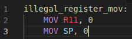

# PEPE-16 Syntax Highlighting

Syntax highlighter for PEPE-16 assembly. Helps more clearly visualize code structure and makes spotting instruction misspellings easier.

## Features

Warns when refrencing reserved registers by their index  

Includes defined pseudo-instructions  

## Known Issues

* Character literals allow more than one character

## Release Notes

### 1.0.6

Updated repository link to refer to new source code location.

### 1.0.5

Added missing entries in changelog.

### 1.0.4

Fixed broken label highlighting.

### 1.0.3

Added autoclosing and autosurrounding for square brackets.

### 1.0.2

Patched labels with numbers inside being highlighted incorrectly.

### 1.0.1

Improved README.
Fixed Changelog.

### 1.0.0

Initial release.
